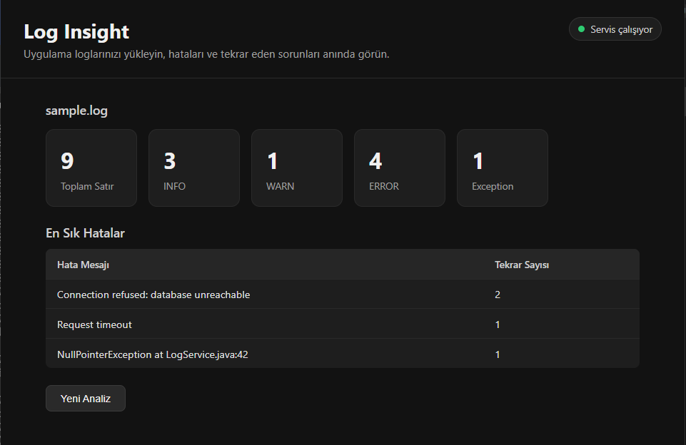
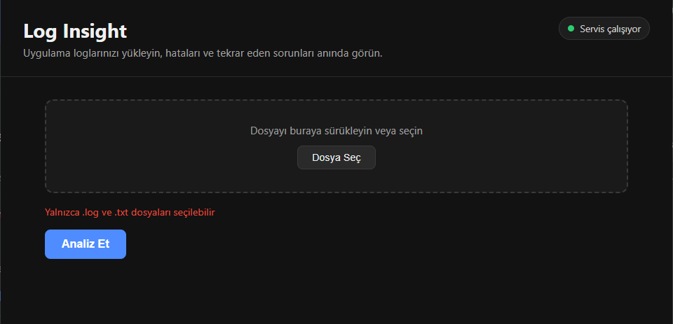
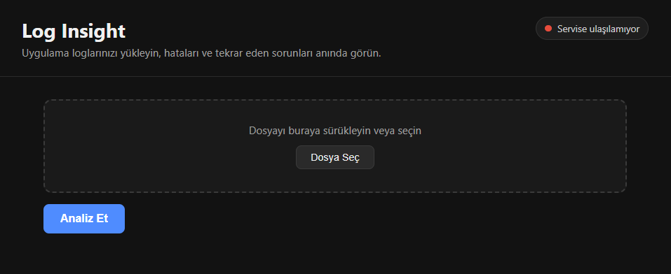
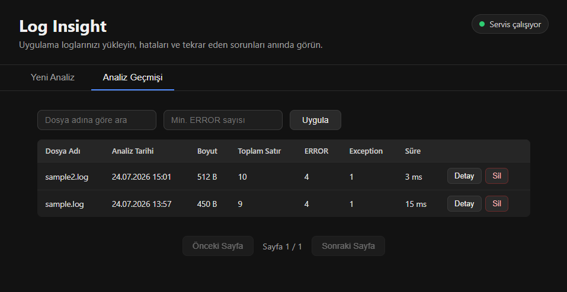
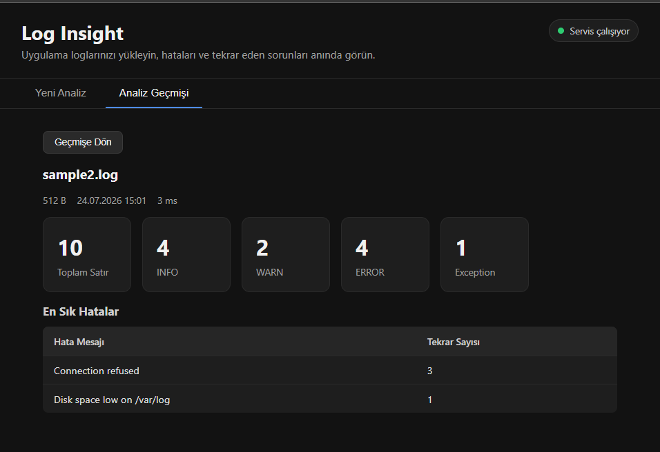
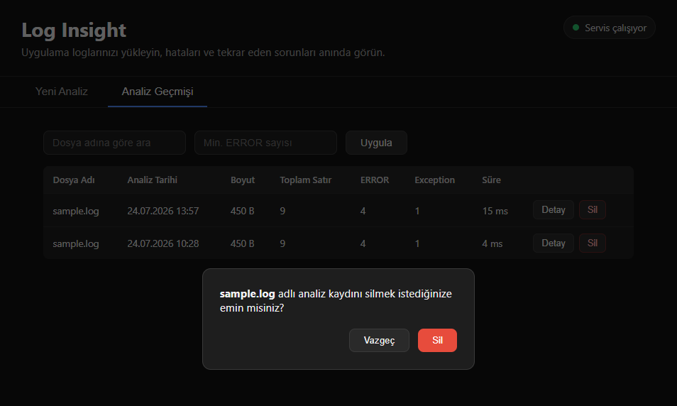

# Log Analiz Uygulaması (log-insight)

## Amaç
Kullanıcının yüklediği `.log` veya `.txt` uzantılı uygulama loglarını analiz eden bir REST API ve bu API'yi kullanan bir web arayüzü. Log seviyelerini (INFO/WARN/ERROR), exception içeren satırları ve tekrar eden hata mesajlarını tespit ederek sonucu hem JSON olarak hem de görsel bir arayüzde sunar. V3 ile birlikte her başarılı analiz PostgreSQL'de kalıcı olarak saklanır; geçmiş analizler listelenebilir, aranabilir, filtrelenebilir, detayları görüntülenebilir ve silinebilir.

## V3 ile Eklenen Özellikler
- Her başarılı analiz sonucunun PostgreSQL'e kalıcı olarak kaydedilmesi (analiz + en sık hata kayıtları tek transaction içinde)
- Liquibase ile veritabanı migration yönetimi (Hibernate `ddl-auto` **kullanılmıyor**, tablolar yalnızca Liquibase ile oluşturuluyor)
- Analiz geçmişini sayfalı (pagination) listeleme, dosya adına göre arama, minimum hata sayısına göre filtreleme
- Tek bir analiz kaydının detayını görüntüleme
- Analiz kaydını kullanıcı onayıyla silme (ilişkili en-sık-hata kayıtları cascade ile birlikte silinir)
- Frontend'e "Analiz Geçmişi" sekmesi, sayfalama kontrolleri, arama/filtre çubuğu, detay ekranı ve silme onay penceresi
- PostgreSQL servisiyle genişletilmiş Docker Compose (named volume ile veri kalıcılığı)
- Gerçek PostgreSQL container'ı üzerinde çalışan Testcontainers entegrasyon testleri

## V2 ile Eklenen Özellikler
- Spring Boot Actuator ile sağlık kontrolü (`/actuator/health`)
- Dosya boyutu limitinin configuration/environment variable üzerinden yönetilmesi
- Standart, makine-okunur hata JSON formatı (`timestamp`, `status`, `error`, `message`, `path`)
- CORS desteği (frontend ile backend arasındaki iletişim için)
- React + TypeScript ile geliştirilmiş web arayüzü
- Docker ve Docker Compose ile tek komutla ayağa kaldırılabilen backend + frontend
- Nginx üzerinden reverse proxy yapılandırması
- Genişletilmiş backend testleri + yeni frontend testleri

## Kullanılan Teknolojiler

**Geliştirme ortamı:** Windows 10/11, WSL2, Ubuntu 22.04, VS Code + WSL eklentisi, Git, GitHub

**Backend:** Java 21, Spring Boot 4.1.0, Maven, Spring Web, Spring Validation, Spring Data JPA, Hibernate, Liquibase, Spring Boot Actuator, JUnit 5, Mockito, AssertJ, Testcontainers

**Frontend:** Node.js LTS, npm, React, TypeScript, Vite, Fetch API, CSS Modules, Vitest, React Testing Library

**Veritabanı ve container:** PostgreSQL 16, Docker, Docker Compose, Nginx

## Proje Klasör Yapısı
```
log-insight/
├── backend/                                  # Spring Boot REST API
│   ├── src/main/java/com/hatice/loginsight/
│   │   ├── controller/                        # HTTP endpoint'leri (LogAnalysisController, AnalysisHistoryController)
│   │   ├── service/                           # İş mantığı (LogAnalysisService, AnalysisHistoryService)
│   │   ├── repository/                        # Spring Data JPA repository'leri
│   │   ├── entity/                             # JPA entity'leri (LogAnalysisEntity, FrequentErrorEntity)
│   │   ├── dto/                                 # Veri transfer nesneleri (entity'ler dışa hiç açılmaz)
│   │   ├── exception/                          # Özel exception'lar + merkezi hata yönetimi
│   │   └── config/                              # CORS gibi uygulama genelinde ayarlar
│   ├── src/main/resources/
│   │   ├── application.properties
│   │   └── db/changelog/                        # Liquibase migration dosyaları
│   ├── src/test/java/                          # Backend testleri (Testcontainers dahil)
│   ├── sample.log                               # Örnek log dosyası
│   ├── sample2.log                              # İkinci örnek log dosyası
│   ├── pom.xml
│   └── Dockerfile
├── frontend/                                    # React + TypeScript web arayüzü
│   ├── src/
│   │   ├── components/                          # Header, FileUpload, HistoryView, AnalysisDetailView, vb.
│   │   ├── services/                            # Backend ile iletişim (logAnalysisApi.ts)
│   │   ├── types/                               # TypeScript tip tanımları
│   │   └── App.tsx
│   ├── nginx.conf                                # Nginx reverse proxy yapılandırması
│   ├── package.json
│   └── Dockerfile
├── screenshots/                                  # Uygulama ekran görüntüleri
├── docker-compose.yml
├── .env.example
└── README.md
```

## Veritabanı Yapısı

V3 ile birlikte iki tablo Liquibase migration'ları üzerinden oluşturuluyor:

**`log_analysis`** — her analiz işleminin özet bilgisi

| Alan | Tip | Açıklama |
|---|---|---|
| `id` | BIGINT (PK, auto increment) | |
| `file_name` | VARCHAR(255) | |
| `file_size` | BIGINT | bayt cinsinden |
| `total_lines` | INT | |
| `info_count` / `warning_count` / `error_count` / `exception_count` | INT | |
| `analyzed_at` | TIMESTAMP | |
| `processing_duration_ms` | BIGINT | analiz süresi (milisaniye) |

**`frequent_error`** — bir analize ait en sık tekrar eden hata mesajları

| Alan | Tip | Açıklama |
|---|---|---|
| `id` | BIGINT (PK, auto increment) | |
| `analysis_id` | BIGINT (FK → `log_analysis.id`, `ON DELETE CASCADE`) | |
| `message` | VARCHAR(1000) | |
| `occurrence_count` | INT | |

Log dosyasının ham içeriği veritabanında saklanmaz — yalnızca analiz sonucu ve dosya metadata'sı kaydedilir.

**Index'ler:** `analyzed_at`, `file_name` ve `error_count` üzerinde — sırasıyla tarihe göre sıralama, dosya adına göre arama ve minimum-hata filtresi sorgularını hızlandırmak için eklendi.

### Entity İlişkilerinin Kısa Açıklaması
`LogAnalysisEntity` ile `FrequentErrorEntity` arasında bire-çok (`@OneToMany`) ilişki var; `cascade = CascadeType.ALL` ve `orphanRemoval = true` sayesinde bir analiz kaydı silindiğinde (ya da bir hata kaydı listeden çıkarıldığında) ilişkili `frequent_error` satırları da JPA seviyesinde otomatik olarak silinir. Aynı davranış veritabanı seviyesinde de `ON DELETE CASCADE` foreign key'i ile güvence altına alınmıştır — yani silme işlemi ister uygulama kodundan ister doğrudan veritabanından yapılsın, tutarlılık korunur.

## Liquibase Migration Yapısı

```
backend/src/main/resources/db/changelog/
├── db.changelog-master.yaml              # Diğer tüm changelog'ları include eder
├── 001-create-log-analysis-table.yaml    # log_analysis tablosu
├── 002-create-frequent-error-table.yaml  # frequent_error tablosu + foreign key
└── 003-add-analysis-indexes.yaml         # analyzed_at / file_name / error_count index'leri
```

Her changeSet için bir `rollback` bloğu tanımlıdır. `spring.jpa.hibernate.ddl-auto=validate` olarak ayarlanmıştır — yani Hibernate hiçbir zaman şema oluşturmaz, sadece entity'lerin Liquibase tarafından oluşturulan şemayla eşleştiğini doğrular. Uygulama her başlatıldığında Liquibase, henüz uygulanmamış migration'ları otomatik olarak çalıştırır.

## Development Ortamında Backend'i Çalıştırma

PostgreSQL'in ayrıca ayakta olması gerekir (bkz. [PostgreSQL Bağlantı Bilgileri](#postgresql-bağlantı-bilgileri)):

```bash
cd backend
./mvnw spring-boot:run
```

Backend `http://localhost:8080` adresinde ayağa kalkar.

### Backend Testlerini Çalıştırma

```bash
cd backend
./mvnw clean test
```

Bu komut V1/V2 testlerinin yanı sıra V3'ün Testcontainers tabanlı entegrasyon testlerini de çalıştırır (bkz. [Testcontainers Testlerinin Çalıştırılması](#testcontainers-testlerinin-çalıştırılması)). Docker Desktop'ın çalışıyor olması gerekir.

## Development Ortamında Frontend'i Çalıştırma

```bash
cd frontend
npm install
npm run dev
```

Frontend `http://localhost:5173` adresinde ayağa kalkar. Backend'in de aynı anda `http://localhost:8080`'de çalışıyor olması gerekir (CORS ayarları bunun için yapılandırılmıştır).

### Frontend Testlerini Çalıştırma

```bash
cd frontend
npm test
```

## PostgreSQL Bağlantı Bilgileri

Development ortamında yerel bir PostgreSQL örneğine ihtiyaç var (Docker ile hızlıca ayağa kaldırılabilir):

```bash
docker run --name log-insight-postgres-manual -e POSTGRES_DB=loginsight \
  -e POSTGRES_USER=loginsight -e POSTGRES_PASSWORD=loginsight \
  -p 5432:5432 -d postgres:16-alpine
```

Backend, `application.properties`'teki şu varsayılanlarla `localhost:5432`'ye bağlanır (aşağıdaki environment variable'larla değiştirilebilir): `DB_HOST=localhost`, `DB_PORT=5432`, `DB_NAME=loginsight`, `DB_USERNAME=loginsight`, `DB_PASSWORD=loginsight`.

## Environment Variable Açıklamaları

| Değişken | Nerede Kullanılır | Varsayılan | Açıklama |
|---|---|---|---|
| `VITE_API_BASE_URL` | Frontend (development) | `http://localhost:8080` | Frontend'in backend'e istek atarken kullandığı taban adres. `frontend/.env` dosyasında tanımlanır, Docker ortamında kullanılmaz (Nginx proxy devrede olduğu için boş bırakılır). |
| `APP_LOG_ANALYSIS_MAX_FILE_SIZE` | Backend | `10MB` | Yüklenebilecek maksimum dosya boyutu. |
| `APP_CORS_ALLOWED_ORIGINS` | Backend | `http://localhost:5173` | Backend'e istek atmasına izin verilen frontend adresi (CORS). Docker Compose'da `http://localhost:3000` olarak ayarlanır. |
| `DB_HOST` | Backend | `localhost` | PostgreSQL sunucu adresi. Docker Compose'da `postgres` (servis adı). |
| `DB_PORT` | Backend | `5432` | PostgreSQL portu. |
| `DB_NAME` | Backend, PostgreSQL | `loginsight` | Veritabanı adı. |
| `DB_USERNAME` | Backend, PostgreSQL | `loginsight` | Veritabanı kullanıcı adı. |
| `DB_PASSWORD` | Backend, PostgreSQL | — | Veritabanı şifresi. Repo'da gerçek değer bulunmaz; `.env.example` yalnızca örnek gösterir. |

`.env.example` dosyası (proje kökünde), gerçek değerler olmadan hangi değişkenlerin gerektiğini gösterir; gerçek `.env` dosyası `.gitignore` ile git'e dahil edilmez.

## Docker Image Oluşturma ve Docker Compose ile Çalıştırma

Projeyi Docker ile ayağa kaldırmak için kök dizinde:

```bash
docker compose up --build
```

Bu komut:
- `backend/Dockerfile`'ı kullanarak backend image'ını (multi-stage: Maven build + JRE runtime) inşa eder.
- `frontend/Dockerfile`'ı kullanarak frontend image'ını (multi-stage: npm build + Nginx runtime) inşa eder.
- Resmi `postgres:16-alpine` image'ını kullanarak `postgres` servisini başlatır.
- Üç container'ı birbirine bağlı şekilde başlatır; backend, postgres'in sağlıklı olmasını, frontend de backend'in sağlıklı olmasını bekler.

Ortamı kapatmak için (veriler korunur):
```bash
docker compose down
```

### Named Volume Davranışı

PostgreSQL verisi `log-insight-postgres-data` adlı named volume'da saklanır. `docker compose down` ve ardından tekrar `docker compose up` yapıldığında veriler **korunur** (volume silinmez). Veritabanını tamamen sıfırlamak (tüm analiz geçmişini silmek) için:

```bash
docker compose down -v
```

## Uygulama Erişim Adresleri

| Servis | Adres |
|---|---|
| Frontend (Docker) | http://localhost:3000 |
| Backend (Docker/Development) | http://localhost:8080 |
| Backend Health Check | http://localhost:8080/actuator/health |
| Frontend (Development, `npm run dev`) | http://localhost:5173 |

## Endpoint'ler

### Analiz Yapma

**POST** `/api/v1/logs/analyze`
Content-Type: `multipart/form-data`
Form alanı: `file`

#### Örnek İstek
```bash
curl -X POST -F "file=@backend/sample.log" http://localhost:8080/api/v1/logs/analyze
```

#### Örnek Cevap
```json
{
  "id": 1,
  "fileName": "sample.log",
  "totalLines": 9,
  "infoCount": 3,
  "warningCount": 1,
  "errorCount": 4,
  "exceptionCount": 1,
  "mostFrequentErrors": [
    { "message": "Connection refused: database unreachable", "count": 2 },
    { "message": "Request timeout", "count": 1 },
    { "message": "NullPointerException at LogService.java:42", "count": 1 }
  ]
}
```

#### Örnek Hata Cevabı
```json
{
  "timestamp": "2026-07-22T15:04:23.000Z",
  "status": 400,
  "error": "EMPTY_FILE",
  "message": "Yüklenen dosya boş",
  "path": "/api/v1/logs/analyze"
}
```

### Analiz Geçmişi Endpoint'leri (V3)

**GET** `/api/v1/analyses` — sayfalı listeleme, arama ve filtreleme

| Parametre | Zorunlu mu | Açıklama |
|---|---|---|
| `page` | hayır (varsayılan `0`) | sayfa numarası |
| `size` | hayır (varsayılan `20`) | sayfa başına kayıt |
| `sort` | hayır (varsayılan `analyzedAt,desc`) | `alan,yön` formatında sıralama |
| `fileName` | hayır | dosya adına göre (büyük/küçük harf duyarsız, kısmi eşleşme) arama |
| `minErrorCount` | hayır | bu sayı ve üzerinde hata içeren kayıtları filtreleme |

```bash
curl "http://localhost:8080/api/v1/analyses?page=0&size=20&sort=analyzedAt,desc&fileName=app&minErrorCount=5"
```

Cevap `content`, `page`, `size`, `totalElements`, `totalPages`, `first`, `last` alanlarını içerir.

**GET** `/api/v1/analyses/{id}` — tek bir analizin detayını döner (dosya metadata'sı, tüm sayaçlar, en sık hatalar, analiz tarihi, işlem süresi). Kayıt yoksa `404 Not Found`.

**DELETE** `/api/v1/analyses/{id}` — analiz kaydını ve ilişkili en-sık-hata kayıtlarını siler. Başarılı silmede `204 No Content`, kayıt yoksa `404 Not Found`.

## Frontend Geçmiş ve Detay Ekranları

Uygulama iki ana görünüme sahiptir (üst kısımdaki sekmelerle geçiş yapılır):

- **Yeni Analiz** — V1/V2'den beri var olan dosya yükleme ve analiz özeti ekranı.
- **Analiz Geçmişi** — kayıtlı tüm analizlerin listesi. Her satırda dosya adı, analiz tarihi, dosya boyutu, toplam satır, ERROR sayısı, exception sayısı, işlem süresi ile birlikte bir **Detay** ve bir **Sil** butonu bulunur. Liste varsayılan olarak analiz tarihine göre azalan sıralıdır; sayfa altında önceki/sonraki sayfa butonları ve mevcut/toplam sayfa bilgisi gösterilir. Üstteki arama çubuğuyla dosya adına göre arama ve minimum ERROR sayısına göre filtreleme yapılabilir.
- **Detay butonuna** basıldığında, o analizin tüm bilgileri (dosya metadata'sı, tüm sayaçlar, en sık hata mesajları tablosu) ayrı bir ekranda gösterilir.
- **Sil butonuna** basıldığında önce bir onay penceresi açılır; onaylanırsa kayıt silinir, başarı mesajı gösterilir ve liste otomatik olarak yenilenir.
- Liste; yükleniyor (loading), boş (empty state), hata (backend erişilemiyor veya beklenmeyen sunucu hatası) durumlarını ayrı ayrı, kullanıcı dostu şekilde ele alır.

## Backend Testleri

```bash
cd backend
./mvnw clean test
```

V1/V2'den gelen tüm testler (dosya validasyonu, log sayaçları, hata gruplama, Actuator health, standart hata formatı) korunmuştur. V3 ile eklenen test senaryoları:
- Başarılı analiz sonucunun veritabanına kaydedilmesi ve en-sık-hata kayıtlarının analiz kaydına bağlanması
- Kayıt başarısız olduğunda transaction'ın geri alınması (rollback)
- Analiz geçmişinin sayfalı listelenmesi, dosya adına göre arama, minimum hata sayısına göre filtreleme
- Analiz detayının getirilmesi ve olmayan bir ID için `404` dönülmesi
- Analiz kaydının ve ilişkili hata kayıtlarının silinmesi
- Liquibase migration'larının tabloları doğru şekilde oluşturduğunun doğrulanması

### Testcontainers Testlerinin Çalıştırılması

Yukarıdaki veritabanı testleri, gerçek bir PostgreSQL örneğini geçici bir Docker container'ında (Testcontainers ile) başlatarak çalışır — mock veya in-memory veritabanı kullanılmaz. Bunun için:
- Docker Desktop (ya da WSL2 üzerinde Docker) çalışır durumda olmalı.
- Ayrıca hiçbir manuel adım gerekmez; `./mvnw clean test` çalıştırıldığında container başlar ve JVM kapanınca (Testcontainers'ın Ryuk bileşeni tarafından) otomatik temizlenir.

## Frontend Testleri

```bash
cd frontend
npm test
```

V1/V2'den gelen tüm testler korunmuştur. V3 ile eklenen senaryolar: analiz geçmişi listesinin yüklenmesi, boş liste durumu, yükleniyor durumu, API hata durumu, sayfalama, dosya adına göre arama, detay ekranının açılması, silme onay penceresinin gösterilmesi ve silme sonrası listenin yenilenmesi. Testlerde gerçek backend yerine API mock'ları kullanılır.

## Nginx Proxy Yapısının Kısa Açıklaması

Development ortamında frontend (`5173`) ve backend (`8080`) farklı portlarda çalıştığı için, tarayıcı bunları farklı origin olarak görüyor ve CORS izni gerekiyor. Docker/production ortamında bu ihtiyacı ortadan kaldırmak için Nginx, hem frontend'in statik dosyalarını (`dist/` çıktısı) sunuyor hem de `/api/` ve `/actuator/` ile başlayan istekleri arka planda backend container'ına yönlendiriyor (reverse proxy). Böylece tarayıcı, tek bir origin'e (`localhost:3000`) konuşuyormuş gibi davranıyor, CORS'a gerek kalmıyor.

## Ekran Görüntüleri

### Başarılı Analiz Ekranı


### Hata Durumu — Desteklenmeyen Dosya Türü


### Hata Durumu — Backend Servisine Erişilememesi


### Analiz Geçmişi Listesi


### Analiz Detay Ekranı


### Silme Onay Penceresi


## Bilinen Eksikler
- Sürükle-bırak (drag-and-drop) desteği eklendi ancak farklı tarayıcılarda kapsamlı test edilmedi.
- `mostFrequentErrors` listesinde üst sınır (örn. ilk 10) uygulanmıyor; çok sayıda benzersiz hata mesajı olan büyük dosyalarda liste uzun olabilir.
- Frontend, backend health check'i sadece sayfa ilk yüklendiğinde kontrol ediyor; periyodik otomatik yenileme yapmıyor.
- Analiz geçmişi listesinde toplu (birden fazla kaydı aynı anda) silme desteği yok; kayıtlar tek tek silinebiliyor.

## Karşılaşılan Sorunlar ve Çözümleri

### V3'e Özgü Sorunlar

- **Liquibase migration'ları hiç çalışmıyordu, tablolar oluşmuyordu:** `docker compose up` sonrası backend "Schema validation: missing table" hatasıyla çöküyordu ve loglarda "liquibase" kelimesi hiç geçmiyordu. Kök sebep: Spring Boot 4.x, Liquibase autoconfiguration'ını `liquibase-core`'dan ayrı, kendi modülüne (`spring-boot-liquibase`) taşımış; bu bağımlılık `pom.xml`'de eksikti, dolayısıyla Spring Boot bu autoconfiguration'ı bir aday olarak bile görmüyordu. `spring-boot-liquibase` bağımlılığı eklenerek çözüldü.
- **Testcontainers, WSL2'de Docker'ı bulamıyordu:** `./mvnw test` sırasında "Could not find a valid Docker environment" hatası alınıyordu; `docker ps` komutu ise sorunsuz çalışıyordu. Kök sebep: Docker Desktop'ın yeni sürümü artık eski, versiyon-önekli API yollarını (`/v1.24/...`) desteklemiyor ve bu isteklere hata yerine boş bir "stub" cevap dönüyor — Testcontainers'ın kullandığı `docker-java` kütüphanesi de bağlantıyı test ederken tam bu eski önekle istek atıyordu. `src/test/resources/docker-java.properties` içine `api.version=1.55` eklenerek (Docker Desktop'ın gerçek API sürümü `curl --unix-socket /var/run/docker.sock http://localhost/version` ile doğrulandı) çözüldü.
- **`./mvnw clean test` tüm testler birlikte çalıştırıldığında ilk testte `HikariPool` bağlantı zaman aşımı, ardından tüm diğer testlerde "Could not open JPA EntityManager" hatası:** Testler tek tek çalıştırıldığında sorunsuzdu, sadece hepsi birlikte çalıştırıldığında bozuluyordu. Kök sebep: `@Testcontainers` + `@Container` kombinasyonu, paylaşılan `static` PostgreSQL container'ını her test sınıfı bitince durduruyordu; bir sonraki sınıf container'ı yeniden başlatınca yeni bir port alıyordu, ama eski (artık ölü) porta bağlanmaya çalışan bağlantı havuzu durumu kalıyordu. Testcontainers'ın resmi "singleton container" desenine geçilerek (`@Testcontainers`/`@Container` kaldırılıp container `static { postgres.start(); }` ile elle, JVM başına bir kez başlatılarak) çözüldü.
- **Analiz kaydı silinirken tarayıcıda `403 Forbidden` hatası:** Backend loglarında hiçbir hata görünmüyordu (istek controller'a hiç ulaşmıyordu). Kök sebep: `WebConfig.java`'daki CORS ayarında `allowedMethods` listesinde yalnızca `GET`, `POST`, `OPTIONS` vardı, `DELETE` eksikti — Spring'in CORS filtresi isteği controller'a ulaşmadan reddediyordu. `DELETE` metodunun listeye eklenmesiyle çözüldü.

### V1/V2'den Devam Eden Sorunlar

- **WSL'de npm'in Windows sürümüne yönlenmesi:** `npm create vite` komutu `ERR_INVALID_URL` hatası veriyordu. Kök sebep, bash'in `npm` komutunu daha önce çalıştırılan Windows npm'ine (`/mnt/c/Program Files/nodejs/npm`) "hash"lemiş olmasıydı. `hash -r` ile bash'in komut önbelleği temizlenerek doğru (Linux) npm'e yönlendirildi.
- **Frontend ↔ Backend CORS hatası:** Tarayıcı konsolunda `No 'Access-Control-Allow-Origin' header` hatası alındı. Normal endpoint'ler için `WebConfig.java` ile CORS tanımlandı; ancak Spring Boot Actuator kendi ayrı CORS mekanizmasını kullandığından, `application.properties`'e ayrıca `management.endpoints.web.cors.*` ayarları eklenmesi gerekti.
- **React Testing Library'de testler arası veri sızıntısı:** Ardışık testlerde "Found multiple elements" hatası alındı. Sebep, `vitest.config.ts`'de `globals` açık olmadığı için Testing Library'nin otomatik `cleanup` mekanizmasının devreye girmemesiydi. `src/test/setup.ts` içine elle `afterEach(() => cleanup())` eklenerek çözüldü.
- **Postman Desktop Agent'ın sürekli çökmesi:** Windows Olay Görüntüleyicisi incelendiğinde `Postman Agent.exe`'nin `0x80000003` hata koduyla çöktüğü görüldü; güvenlik yazılımı/ağ ayarlarıyla ilgisiz olduğu anlaşıldı. Alternatif olarak Insomnia kullanılarak API manuel test edildi.

## Yapay Zekâ Kullanım Açıklaması

**Kullanılan AI aracı:** Claude (Anthropic)

**Yapay zekâdan hangi konularda destek alındığı:**
- Backend'e Actuator, configuration-tabanlı dosya boyutu limiti, standart hata formatı ve CORS eklenmesi
- React + TypeScript proje mimarisinin tasarımı (component ayrımı, servis katmanı, tip tanımları)
- Docker multi-stage build ve Nginx reverse proxy yapılandırması
- Veritabanı şeması tasarımı, Liquibase migration yapısı, JPA entity ilişkileri (cascade, orphanRemoval, foreign key)
- Pagination, arama ve filtreleme mantığının (Spring Data `Specification` ile) tasarımı ve implementasyonu
- Analiz geçmişi ve detay ekranları için frontend component'lerinin (HistoryView, Pagination, SearchFilterBar, AnalysisDetailView, DeleteConfirmDialog) tasarımı
- Frontend ve backend test senaryolarının yazımı (Testcontainers dahil)
- WSL/npm/Postman/Docker Desktop/Liquibase/Testcontainers ile ilgili ortam ve konfigürasyon sorunlarının kanıta dayalı olarak debug edilmesi

**Veritabanı tasarımı için alınan destek:**
- `log_analysis` / `frequent_error` tablo şeması ve aralarındaki foreign key ilişkisi, spec'te önerilen alan adları temel alınarak birlikte tasarlandı.
- Hangi alanlarda index tutulacağına (`analyzed_at`, `file_name`, `error_count`) sorgu paternlerine (sıralama, arama, filtreleme) göre karar verildi.

**Liquibase için kullanılan önemli promptlar:**
- "Liquibase zorunlu olarak kullanılmalı, Hibernate tablo yapısını otomatik oluşturmamalı" gereksinimi doğrultusunda `spring.jpa.hibernate.ddl-auto=validate` ayarlandı ve tüm şema değişiklikleri changelog dosyalarına taşındı.
- Liquibase'in beklenmedik şekilde hiç çalışmadığı (tablo oluşturmadığı) durumda, "kanıt topla, tahmin yürütme" yaklaşımıyla adım adım ilerlendi (bkz. Karşılaşılan Sorunlar) — kök sebep Spring Boot 4.x'in Liquibase autoconfiguration'ını ayrı bir modüle taşımış olmasıydı.

**JPA ilişkileri için kullanılan önemli promptlar:**
- "İlgili frequent error kayıtları da kontrollü şekilde silinmelidir" gereksinimi, `@OneToMany(cascade = CascadeType.ALL, orphanRemoval = true)` ile hem JPA hem veritabanı (`ON DELETE CASCADE`) seviyesinde karşılandı.

**Pagination ve filtreleme için kullanılan önemli promptlar:**
- "Pagination ve filtreleme service katmanında yönetilmelidir" ve "controller içerisinde veritabanı erişimi yapılmamalıdır" gereksinimleri, `AnalysisHistoryService` içinde `Specification<LogAnalysisEntity>` kullanılarak, controller'ın yalnızca DTO/service çağrısı yaptığı bir katmanlamayla karşılandı.

**UI tasarımı için kullanılan önemli promptlar:**
- "Frontend aşağıdaki bileşenlere ayrılabilir: App, Header, BackendStatus, FileUpload, AnalysisSummary, StatCard, FrequentErrorsTable, ErrorAlert, LoadingIndicator" şeklindeki spec maddesi doğrudan component yapısına dönüştürüldü.
- "Backend'den dönen teknik hata mesajı doğrudan ve kontrolsüz biçimde kullanıcıya gösterilmemeli" gereksinimi, `LogAnalysisApiError` sınıfı ve `App.tsx`'teki hata ayrımı (`instanceof` kontrolü) ile karşılandı.
- V3'te "Analiz Geçmişi bölümü eklenmelidir... en az iki ana görünüm" gereksinimi `NavigationTabs` component'iyle, "silme öncesinde kullanıcıdan onay alınmalıdır" gereksinimi `DeleteConfirmDialog` ile karşılandı.

**Docker yapılandırması için kullanılan önemli promptlar:**
- "Backend Dockerfile: Multi-stage build kullanılmalı, runtime image mümkün olduğunca küçük olmalı" — bu doğrultuda `eclipse-temurin:21-jdk` (build) → `eclipse-temurin:21-jre` (runtime) ayrımı yapıldı.
- "Nginx, /api ile başlayan istekleri backend servisine yönlendirebilir" — `nginx.conf`'taki `location /api/ { proxy_pass ... }` bloğu bu şekilde oluşturuldu.
- "PostgreSQL servisi için named volume ve healthcheck tanımlanmalıdır" — `docker-compose.yml`'e `log-insight-postgres-data` named volume'u ve `pg_isready` tabanlı healthcheck eklendi.

**Yapay zekânın ürettiği kodlarda yapılan manuel değişiklikler:**
- Hata mesajı çıkarma mantığında baştaki `:` karakterinin temizlenmesi eklendi (V1'den beri süregelen bir düzeltme).
- `ActuatorHealthTest`, ilk üretilen haliyle `TestRestTemplate` kullanıyordu, bu sınıf mevcut Spring Boot sürümünde bulunamadığı için `HttpClient` (Java'nın kendi standart kütüphanesi) kullanan bir versiyonla değiştirildi.
- İlk üretilen `AbstractIntegrationTest`, `@Testcontainers`/`@Container` kullanıyordu; test-sınıfları-arası container yeniden başlatma sorunu keşfedilince, elle yönetilen "singleton container" desenine geçildi.
- İlk üretilen `LiquibaseConfig.java` (elle tanımlanmış `SpringLiquibase` bean'i) sorunu çözmediği gibi, aslında JPA-Liquibase sıralama garantisini bozduğu için tamamen kaldırıldı; kök sebep bulununca (`spring-boot-liquibase` bağımlılığının eksikliği) buna hiç ihtiyaç kalmadı.

**Hatalı veya projeye uygun olmadığı için reddedilen öneriler:**
- `LogAnalysisControllerTest` için önerilen `@AutoConfigureMockMvc` tabanlı yaklaşım, projedeki Spring Boot sürümüyle derleme hatası verdiği için reddedildi; bunun yerine mevcut `standaloneSetup` + `@BeforeEach` yaklaşımı korundu.
- Testcontainers/Docker bağlantı sorununda ilk denenen `DOCKER_API_VERSION` ortam değişkeni çözüm getirmedi (yanlış katmanda etkili olduğu anlaşıldı); kalıcı çözüm olarak `docker-java.properties` dosyası kullanıldı.

**Yapay zekâdan alınan kodların nasıl test edildiği:**
- Her backend değişikliğinden sonra `mvn clean test` ile otomatik testler, ayrıca `curl` ile manuel uçtan uca senaryolar (geçerli dosya, boş dosya, yanlış uzantı, boyut aşımı, analiz geçmişi endpoint'leri) çalıştırıldı.
- Her frontend değişikliğinden sonra `npm test` ile otomatik testler, ayrıca tarayıcıdan (`localhost:5173` ve Docker'da `localhost:3000`) manuel olarak dosya yükleme/analiz, geçmiş listeleme, arama/filtreleme, detay görüntüleme ve silme akışları denendi.
- Docker Compose kurulumu, `docker compose up --build` ile ayağa kaldırılıp hem `curl` hem tarayıcı üzerinden doğrulandı; PostgreSQL'e `psql` ile bağlanılarak tabloların (`\dt`) ve verilerin gerçekten oluştuğu/kalıcı olduğu (`down` + `up` sonrası) kontrol edildi.
- Liquibase migration'larının doğru çalıştığı, hem uygulama loglarında hem `psql \dt` çıktısında tabloların görünmesiyle doğrulandı.
- Testcontainers testleri, hem tek tek (`-Dtest=SınıfAdı`) hem tüm paket (`./mvnw clean test`) olarak, farklı ortam senaryolarında (Docker Desktop farklı sürümlerinde, docker-compose stack'i açık/kapalıyken) tekrar tekrar çalıştırılarak doğrulandı.

**V3 sırasında öğrenilen konular:**
- Spring Data JPA'da `@OneToMany`, `cascade`, `orphanRemoval` ve bunların foreign key `ON DELETE CASCADE` ile ilişkisi
- `@Transactional`'ın rollback davranışı ve transaction sınırlarının service katmanında tutulmasının önemi
- Entity/DTO ayrımının neden gerekli olduğu (entity'nin dış katmana sızmaması)
- Spring Data `Specification` ile dinamik, birleştirilebilir sorgu filtreleri yazımı
- Liquibase changelog yapısı, changeSet/rollback mantığı ve Spring Boot'un otomatik konfigürasyon mekanizmasının (autoconfiguration) sürüm sürüm nasıl değişebileceği
- Testcontainers'ın JUnit5 yaşam döngüsü yönetimi (`@Testcontainers`/`@Container`) ile "singleton container" deseni arasındaki fark ve bunun test-sınıfları-arası paylaşılan durum üzerindeki etkisi
- Docker Desktop'ın iç API/soket yapısının (WSL2 üzerinde) nasıl işlediği ve bir istemci kütüphanesinin (docker-java) bunu yanlış yorumlamasının nasıl teşhis edileceği
- Spring'in CORS filtresinin, isteği controller'a hiç ulaştırmadan (ve dolayısıyla loglara hiç düşürmeden) reddedebileceği